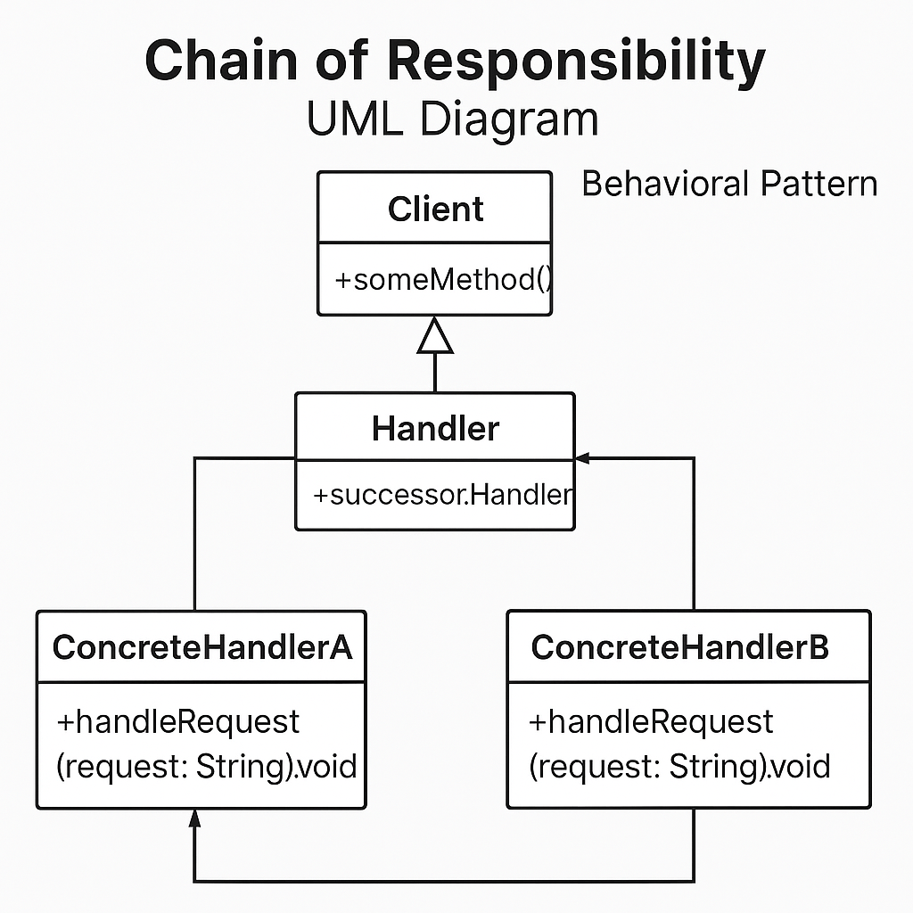

# Chain of Responsibility - Padrão de Projeto Comportamental

## 📌 Descrição

O **Chain of Responsibility** é um padrão de projeto comportamental que permite passar uma requisição por uma cadeia de manipuladores. Cada manipulador decide se processa a requisição ou a repassa para o próximo na cadeia.

### 🧠 Quando usar?

- Quando você quer **desacoplar** o remetente de uma solicitação dos seus receptores.
- Quando você precisa **vários objetos** que podem tratar uma requisição de maneira flexível.

---

## 💡 Estrutura

- **Handler (Manipulador)**: Interface comum para todos os manipuladores.
- **ConcreteHandler**: Manipuladores específicos que tratam ou repassam a requisição.
- **Client**: Cria a cadeia e envia requisições.

---

## 🧪 Exemplo em Java

```java
// Handler
abstract class Handler {
    protected Handler next;

    public void setNext(Handler next) {
        this.next = next;
    }

    public abstract void handleRequest(String request);
}

// ConcreteHandler1
class AuthHandler extends Handler {
    @Override
    public void handleRequest(String request) {
        if (request.equals("auth")) {
            System.out.println("Autenticação realizada.");
        } else if (next != null) {
            next.handleRequest(request);
        }
    }
}

// ConcreteHandler2
class LoggingHandler extends Handler {
    @Override
    public void handleRequest(String request) {
        if (request.equals("log")) {
            System.out.println("Log registrado.");
        } else if (next != null) {
            next.handleRequest(request);
        }
    }
}

// ConcreteHandler3
class ErrorHandler extends Handler {
    @Override
    public void handleRequest(String request) {
        System.out.println("Requisição não reconhecida: " + request);
    }
}

// Client
public class Main {
    public static void main(String[] args) {
        Handler auth = new AuthHandler();
        Handler log = new LoggingHandler();
        Handler error = new ErrorHandler();

        auth.setNext(log);
        log.setNext(error);

        auth.handleRequest("auth");
        auth.handleRequest("log");
        auth.handleRequest("outro");
    }
}
```

## 🔗 Diagrama UML




📘 Benefícios
- **Baixo acoplamento** entre os objetos que emitem requisições e os que as processam.

- **Flexibilidade** para adicionar ou remover manipuladores.

❌ Desvantagens
- Não há garantia de que a requisição será tratada.

- Pode ser difícil depurar a cadeia.